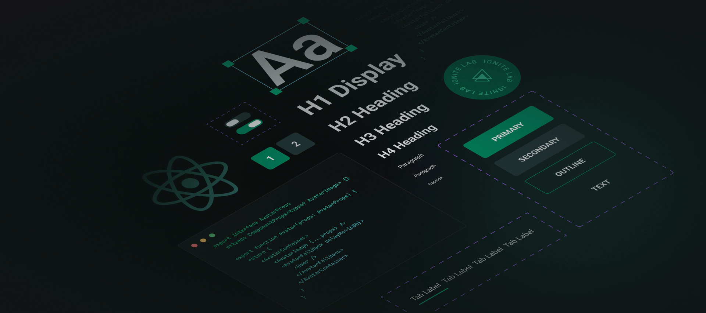
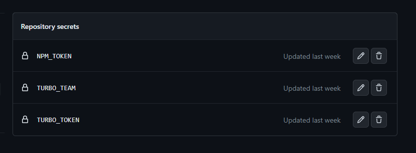

### 🎉 Sobre o projeto

Designer System da Airs UI.

O Designer System da Airs UI é uma aplicação desenvolvida com as melhores práticas e fluxo de desenvolvimento performático, utilizando as mais avançadas tecnologias. O objetivo é oferecer uma solução completa para o desenvolvimento de design systems de alta qualidade.

---

### 🛠️ Tecnologias

- [Typescript](https://www.typescriptlang.org/)
- [Phosphor Icons](https://phosphoricons.com/)
- [Stitches](https://stitches.dev/)
- [Radix](https://www.radix-ui.com/)
- [Storybook](https://storybook.js.org/)
- [tsup](https://github.com/egoist/tsup)
O `tsup` é uma ferramenta de empacotamento e compilação de projetos TypeScript. Ele é usado para criar um único arquivo JavaScript otimizado a partir do código TypeScript, tornando-o mais adequado para ambientes de produção. O `tsup` simplifica o processo de compilação e empacotamento, oferecendo uma maneira fácil de construir e distribuir aplicativos e bibliotecas TypeScript.
- [changeset](https://github.com/changesets/changesets)
O `changeset` é uma ferramenta que auxilia no gerenciamento de alterações e versionamento de projetos. Ele permite que você agrupe e documente as modificações feitas no código-fonte, facilitando o rastreamento e a revisão das mudanças realizadas ao longo do tempo. Com o `changeset`, é possível gerar um arquivo de documentação das modificações, atualizar as versões das dependências e realizar o versionamento adequado do projeto. Ele é especialmente útil em projetos colaborativos e em equipes de desenvolvimento, fornecendo uma forma organizada e padronizada de lidar com as alterações no código.
- [Turbo Build](https://turbo.build/)
O `Turbo Build` é um serviço de construção e implantação de aplicativos web que visa acelerar o processo de desenvolvimento e melhorar o desempenho das aplicações. Ele utiliza técnicas de compilação antecipada e otimizações avançadas para gerar um pacote otimizado do aplicativo, pronto para ser implantado em um servidor. O `Turbo Build` automatiza muitas tarefas tediosas de configuração e empacotamento, permitindo que os desenvolvedores se concentrem mais na lógica de negócios e menos nas complexidades da configuração de ambientes de produção. Ele é especialmente útil para projetos em JavaScript/TypeScript e frameworks como React, Vue e Angular, fornecendo um fluxo de trabalho simplificado e eficiente para o desenvolvimento e implantação de aplicações web.

Nessa aplicação em particular, o `Turbo Build` foi usado para otimizar e acelerar o processo de construção (builder) e execução do comando `npm run dev` simultaneamente para os pacotes de React, tokens e docs. Ele permite que essas tarefas sejam executadas de forma paralela, economizando tempo e melhorando a eficiência do desenvolvimento.

Além disso, o `Turbo Build` também foi utilizado para aplicar o conceito de ["Remote Caching"](https://vercel.com/docs/concepts/monorepos/remote-caching#use-remote-caching-from-external-ci/cd) durante a execução dos workflows. Isso significa que, durante o processo de deploy, o `Turbo Build` aproveita o cache remoto para agilizar a compilação e implantação, melhorando ainda mais o desempenho geral do processo.

Essas abordagens ajudam a reduzir o tempo necessário para construir e implantar a aplicação, melhorando a produtividade dos desenvolvedores e proporcionando uma experiência mais ágil no ciclo de desenvolvimento.

### 🔧 Instalação

1. Clone este repositório em sua máquina local:

```bash
$ git clone https://github.com/MauricioAires/design-system-airs
```

2. Na pasta raiz do projeto, instale as dependências:

```bash
  $ npm install
```

### ⚙️ Utilização

Para rodar a aplicação em modo de desenvolvimento, utilize o seguinte comando:

```bash
  $ npm run dev
```

### 🚀 Fluxo de deploy

1. Realize as modificações necessárias no código.
2. Execute o comando `npm run changeset` para gerar o arquivo de documentação com as modificações.
3. Execute o comando `npm run version-packages` para atualizar o pacote com a versão do changeset.
4. Faça o push das modificações para o GitHub. Após isso, o GitHub se encarregará de atualizar automaticamente o GitHub Pages e o pacote no npm.

Esses passos garantem um fluxo de trabalho suave e automatizado, permitindo que as modificações sejam refletidas corretamente no GitHub Pages e no pacote npm.

### 🚀 Github Workflow

Para que o workflow de deploy para o GitHub Pages funcione corretamente, é necessário habilitar a permissão adequada. Siga os passos abaixo:

1. Acesse a página de configurações do seu repositório no GitHub: `https://github.com/USERNAME/REPOSITORY/settings`.
2. Clique na guia "Actions > Geral" na barra lateral esquerda.
3. Na seção "Workflow permissions", verifique se a opção "Read and write permissions" (Permissões de leitura e gravação) está selecionada. Caso contrário, clique para permitir a execução dos workflows de ação.


4. Certifique-se de que as permissões estão corretamente configuradas para permitir a implantação no GitHub Pages.

Após seguir esses passos e habilitar as permissões necessárias, o workflow de deploy para o GitHub Pages poderá ser executado com sucesso.

### 📦 NPM package

Confira o deploy do Designer System publicado no NPM: [https://www.npmjs.com/package/@airs-ui/docs](https://www.npmjs.com/package/@airs-ui/docs)

### 🔒 Github Workflow Repository Secrets

Os workflows de deploy e release utilizam algumas secrets que precisam ser configuradas no GitHub. Siga os passos abaixo para acessar as configurações de secrets:

1. Acesse a página de configurações do seu repositório no GitHub: [https://github.com/USERNAME/REPOSITORY/settings/secrets/actions](https://github.com/USERNAME/REPOSITORY/settings/secrets/actions).
2. Certifique-se de estar na guia "Secrets" (Segredos) no menu lateral esquerdo.
3. Clique em "New repository secret" (Novo segredo do repositório) para adicionar uma nova secret.
4. Preencha o nome da secret e o valor correspondente. Essas informações serão fornecidas no processo de configuração do workflow.
5. Clique em "Add secret" (Adicionar segredo) para salvar a secret.



- NPM_TOKEN: [NPM Token](https://docs.npmjs.com/creating-and-viewing-access-tokens)
- TURBO_TOKEN:  [Vercel Tokens](https://vercel.com/account/tokens)
- TURBO_TEAM:  Vercel username/teamname

Ao configurar as secrets necessárias, os workflows de deploy e release poderão ser executados corretamente, utilizando as informações protegidas e configuradas nas secrets.

### 🤝 Contribuição

Contribuições são bem-vindas! Para contribuir, basta abrir uma issue ou pull request neste repositório.

### 📝 Licença

Este projeto está sob a licença MIT.
Veja [LICENSE](LICENSE) para mais informações.

---

### 👨‍💻 Autor

Feito com 💙 by Mauricio Aires
