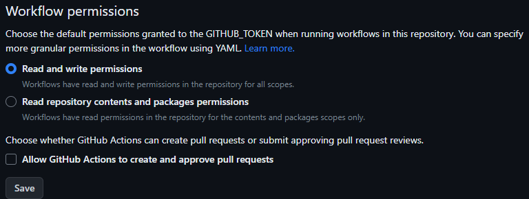

### Turborepo

1. Server para executar scripts em vários repositórios ao mesmo tempo
2. Acelerar o processo de build

### Github Workflow

Para que o workflow de deploy funcione corretamente e necessário habilitar essa permissão:

URL atual <https://github.com/USERNAME/REPOSITORY/settings/actions>

### NPM package

https://www.npmjs.com/package/@airs-ui/docs

### Remote Caching Vercel

Para utilizar o remote caching da vercel para melhorar a performance e o tempo de build do design system [https://vercel.com/doc](https://vercel.com/docs/concepts/monorepos/remote-caching)

### Changesets

[Documentation](https://github.com/changesets/changesets)

É um gerenciador de versionamento de repositórios

Também foi utilizado um workflow para a automatização do gerenciamento da versão do repositório modificado e a publicação no NPM.

### Vercel Accesstoken

[https://vercel.com/account/tokens](https://vercel.com/account/tokens)

### Github workflow repository secrets

[https://github.com/USERNAME/REPOSITORY/settings/secrets/actions](https://github.com/USERNAME/REPOSITORY/settings/secrets/actions)

> Repository secrets
  TURBO_TOKEN =  Vercel Accesstoken
  TURBO_TEAM =  Vercel username/teamname

  ### Fluxo de deploy

1.  Realiazar modificações
2. npm run changeset (gerar o arquivo de documentação com as modificações)
3. npm run version-packages (atualizar o package com a versão do changeset)
4. subir as modificações para o github, depois disso o github irá cuidar de atualizar o
githubpages e atualizar o pacote no npm
